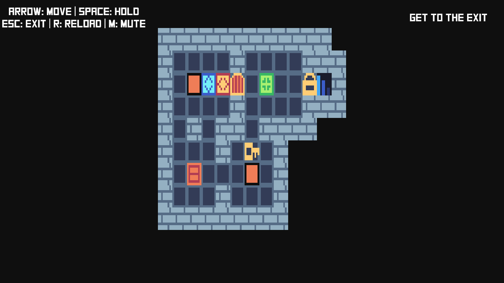

# Rust Action Heroes



Rust Action Heroes is a remake of the delightful [One Action Heroes][oah] game-jam written in Rust using the wonderful game engine [Amethyst][amethyst].

Rust Action Heroes is my first attempt at writing a game, so it's pretty shoddy.
If you have feedback, please [make an issue on the repo][issue].

If you are new to Amethyst, check out the [Amethyst Book][amethyst-book] which covers the ECS architecture, what a System, Component, State, and Entity are.

If you are interested in how this game works under the good, checkout the [Rust Action Heroes API docs][api-docs].

## Why One Action Heroes?

I've wanted to get into making games for a long time, but I've struggled to complete any projects of my own.
Every game I've tried to make is either too ambitious or too ill-defined.

One Action Heroes was fun to play, mechanically simple, and was the product of a game-jam so I figured it couldn't take _that_ long to implement.
I had to learn Amethyst along the way, so I knew I wouldn't get it done in 48 hours, but it seemed achievable in a few Saturdays.

Thankfully, my theory was correct and the project worked out!
I can finally say I have created a buggy, sketchy, and in most ways worse version of One Action Heroes.

But you know what, it was a blast to make and I learned a lot about making games.
I learned a lot in the process and now I feel ready to take on a creative project of my own.

## Modding/"Custom Level Editor"

If you're interested, you can make your own levels by adding files to `assets/levels/`.

Levels are really simple ascii-art.

| Char       | Entity                        |
| ---------- | ----------------------------- |
| W, w, #    | Wall                          |
| H, h       | Prince horizontival the first |
| V, v       | Duke vert the pure            |
| G, g       | Grabaron the wise             |
| C, c       | Crate                         |
| E, e       | Exit                          |
| K, k       | Key (for locks)               |
| L, l       | Locks (for keys)              |
| S, s       | Switch (for doors)            |
| D, d       | Door (for switches)           |
| space      | Floor                         |
| tab        | 4 Floors                      |

Levels are loaded in alphabetical order, so level `00` will load first, then `01`, etc.

There's not very good error checking/runtime enforcement of game rules -- so if you create a level with no Exit you can't complete the leve.

Happy modding!

## How to run the game

To run the game, run the following command, which defaults to the `vulkan` graphics back-end:

```bash
cargo run
```

Windows and Linux users may explicitly choose `"vulkan"` with the following command:

```bash
cargo run --no-default-features --features "vulkan"
```

Mac OS X users may explicitly choose `"metal"` with the following command:

```bash
cargo run --no-default-features --features "metal"
```

## Binary releases

I haven't had a chance to create any binary releases of the game.

If you know how best to compile a Rust/Amethyst project for Linux, Windows, and Mac let me know!

# License/copyright

The original [One Action Heroes prototype game][oah] was created by Tapehead Games for the Game Maker's Toolkit game jam 2019.

I am not associated with Tapehead in any way, I just really like their game and got a lot of inspiration from it.
If/when One Action heroes gets made into a fully fledged game, you should buy it on [Taphead's itch.io page][tapehead-games].

The code in this project is MIT licensed.

[tapehead-games]: https://tapehead-co.itch.io/
[oah]: https://tapehead-co.itch.io/one-action-heroes
[amethyst]: https://amethyst.rs/
[amethyst-book]: https://book.amethyst.rs/stable/
[issue]: https://github.com/pop/rust-action-heroes/issues/
[api-docs]: https://pop.github.io/rust-action-heroes/

